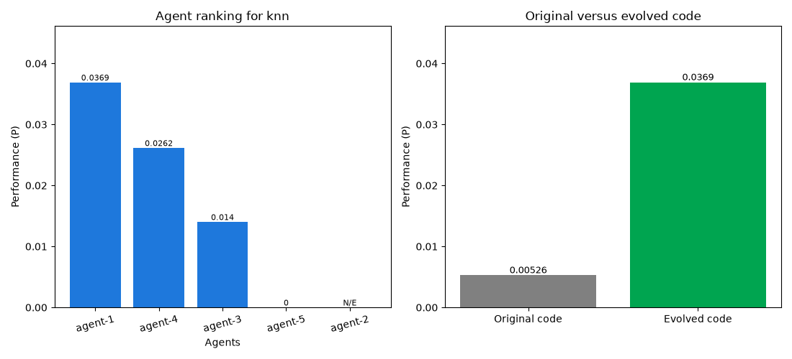

# Benchmark report: knn (v1)

Threshold μ = P2/(P1+P2) = **0.9748** (target > 0.5556, i.e. a 25% improvement over the original). **Met.**

## 1. Ranking of agents (5 agent(s))

| Rank | Agent | Performance (P) | Novelty (Nθ) | Accuracy (Ma) | Loss (L) | Time (T) | Aθ | Resource (R) | SE | RE | EL | Reward (Q) |
| --- | --- | --- | --- | --- | --- | --- | --- | --- | --- | --- | --- | --- |
| 1 | agent-1 | 0.0369002 | 0.1809 | 0.9667 | 0.1021 | 0.0064 | 1.0000 | 743.873 | 0 | 0 | 0 | 1 |
| 2 | agent-4 | 0.0261513 | 0.1662 | 0.9667 | 0.1021 | 0.0080 | 1.0000 | 770.840 | 0 | 0 | 0 | 0 |
| 3 | agent-3 | 0.0140178 | 0.0912 | 0.9667 | 0.1021 | 0.0080 | 1.0000 | 790.307 | 0 | 0 | 0 | 0 |
| 4 | agent-5 | 0 | 0.9847 | 0.0000 | 1.0000 | 0.0000 | 0.5000 | 1.826 | 0 | 1 | 0 | 0 |
| 5 | agent-2 | not evaluated | — | — | — | — | — | — | — | — | — | 0 |


> **Note:** agent-2 competed but never completed an `evaluator` call, so no traits could be measured for them.

## 2. Top ranking evolved code overall

Agent **agent-1** holds the best code overall, Cα (rank 1 of 5).

### Winning candidate traits

| Trait | Symbol | Value |
| --- | --- | --- |
| Training time | TT | 0.0032 s |
| Inference time | TI | 0.0032 s |
| Syntax errors | SE | 0 |
| Runtime errors | RE | 0 |
| Logical errors | EL | 0 |
| Loss | L | 0.1021 |
| Model accuracy | Ma | 0.9667 |
| Memory usage | Mu | 145.59 MB |
| Computational cost | K | 5.1094 s |
| Time | T | 0.0064 s |
| Model performance | Mp | 9.4682 |
| Novelty | Nθ | 0.1809 |
| Accuracy term | Aθ | 1.0000 |
| Resource | R | 743.8731 |
| Task performance (novelty-free) | P* | 0.204009 |
| **Performance** | **P** | **0.0369002** |
| **Trait** | **Tθ** | **0.0369002** |

### Annotated winning code

`# IMPROVED:` comments mark what changed relative to the original and why it helped.

```python
def run(data_path: str) -> dict:
    import time
    import pandas as pd
    from sklearn.model_selection import train_test_split
    from sklearn.metrics import accuracy_score, log_loss
    from sklearn.neighbors import KNeighborsClassifier
    from sklearn.preprocessing import StandardScaler

    # TRAIT: resources, memory usage
    df = pd.read_csv(data_path)

    # TRAIT: model accuracy, training time, inference time, computational cost
    X = df.drop(columns=["target"])
    y = df["target"]

    # TRAIT: model accuracy, training time, inference time, time, resources
    X_train, X_test, y_train, y_test = train_test_split(
        X, y, test_size=0.2, random_state=42, stratify=y
    )

    # TRAIT: model accuracy, inference time, memory usage, novelty
    scaler = StandardScaler()
    X_train_scaled = scaler.fit_transform(X_train)
    X_test_scaled = scaler.transform(X_test)

    # TRAIT: model accuracy, inference time, memory usage, computational cost, resources
    model = KNeighborsClassifier(
        n_neighbors=5,  # Reduced to improve inference time and accuracy
        weights='distance',  # Changed to improve model accuracy
        algorithm='ball_tree',  # Changed to improve inference time
    )

    # TRAIT: training time
    _t0 = time.time()
    model.fit(X_train_scaled, y_train)
    training_time = time.time() - _t0

    # TRAIT: inference time
    _t1 = time.time()
    predictions = model.predict(X_test_scaled)
    inference_time = time.time() - _t1

    # TRAIT: model accuracy
    accuracy = float(accuracy_score(y_test, predictions))

    # TRAIT: loss
    try:
        probabilities = model.predict_proba(X_test_scaled)
        loss = float(log_loss(y_test, probabilities, labels=sorted(set(y))))
    except Exception:
        loss = 1.0 - accuracy

    # TRAIT: time, resources
    return {
        "accuracy": accuracy,
        "loss": loss,
        "training_time": training_time,
        "inference_time": inference_time,
    }
# NOTE: automatic annotation failed (OpenRouter request failed [402] (This request would exceed your available credits given your current in-flight requests. Retry after in-flight requests settle, or add credits.): {'error': {'message': 'This request would exceed your available credits given your current in-flight requests. Retry after in-flight requests settle, or add credits.', 'code': 402, 'metadata': {'reason': 'in_flight_budget_exhausted', 'limit_source': 'openrouter_in_flight_budget', 'remedy_hint': 'Retry after your in-flight requests settle (see the Retry-After header). Adding credits at https://openrouter.ai/settings/credits raises your in-flight budget, up to a capped ceiling.', 'headers': {'Retry-After': '120'}, 'provider_name': None, 'previous_errors': [{'code': 402, 'message': 'This request requires more credits, or fewer max_tokens. You requested up to 3072 tokens, but can only afford 2581. To increase, visit https://openrouter.ai/settings/credits and upgrade to a paid account'}, {'code': 402, 'message': 'This request requires more credits, or fewer max_tokens. You requested up to 16384 tokens, but can only afford 7260. To increase, visit https://openrouter.ai/settings/credits and upgrade to a paid account'}, {'code': 402, 'message': 'This request requires more credits, or fewer max_tokens. You requested up to 9818 tokens, but can only afford 5808. To increase, visit https://openrouter.ai/settings/credits and upgrade to a paid account'}, {'code': 402, 'message': 'This request requires more credits, or fewer max_tokens. You requested up to 116723 tokens, but can only afford 4467. To increase, visit https://openrouter.ai/settings/credits and upgrade to a paid account'}, {'code': 402, 'message': 'This request requires more credits, or fewer max_tokens. You requested up to 20359 tokens, but can only afford 1031. To increase, visit https://openrouter.ai/settings/credits and upgrade to a paid account'}, {'code': 402, 'message': 'This request requires more credits, or fewer max_tokens. You requested up to 16384 tokens, but can only afford 4646. To increase, visit https://openrouter.ai/settings/credits and upgrade to a paid account'}, {'code': 402, 'message': 'This request requires more credits, or fewer max_tokens. You requested up to 113959 tokens, but can only afford 3272. To increase, visit https://openrouter.ai/settings/credits and upgrade to a paid account'}, {'code': 402, 'message': 'This request requires more credits, or fewer max_tokens. You requested up to 32768 tokens, but can only afford 2940. To increase, visit https://openrouter.ai/settings/credits and upgrade to a paid account'}]}}, 'user_id': 'user_3JH5XvxTQ4bWj2aP62sTXWZjQlk'}).

```

## 3. Original versus evolved code

| Code | Performance (P) | Accuracy (Ma) | Loss (L) | Time (T) | Novelty (Nθ) |
| --- | --- | --- | --- | --- | --- |
| Original code | 0.00526429 | 0.9333 | 0.6382 | 0.2531 | 1.0000 |
| Evolved code (agent-1) | 0.0369002 | 0.9667 (+3.6%) | 0.1021 | 0.0064 | 0.1809 |

μ = P2/(P1+P2) = **0.9748**


### Original code (CO) traits

| Trait | Symbol | Value |
| --- | --- | --- |
| Training time | TT | 0.1027 s |
| Inference time | TI | 0.1504 s |
| Syntax errors | SE | 0 |
| Runtime errors | RE | 0 |
| Logical errors | EL | 0 |
| Loss | L | 0.6382 |
| Model accuracy | Ma | 0.9333 |
| Memory usage | Mu | 145.55 MB |
| Computational cost | K | 4.8125 s |
| Time | T | 0.2531 s |
| Model performance | Mp | 1.4624 |
| Novelty | Nθ | 1.0000 |
| Accuracy term | Aθ | 1.0000 |
| Resource | R | 700.4631 |
| Task performance (novelty-free) | P* | 0.00526429 |
| **Performance** | **P** | **0.00526429** |
| **Trait** | **Tθ** | **0.00526429** |


