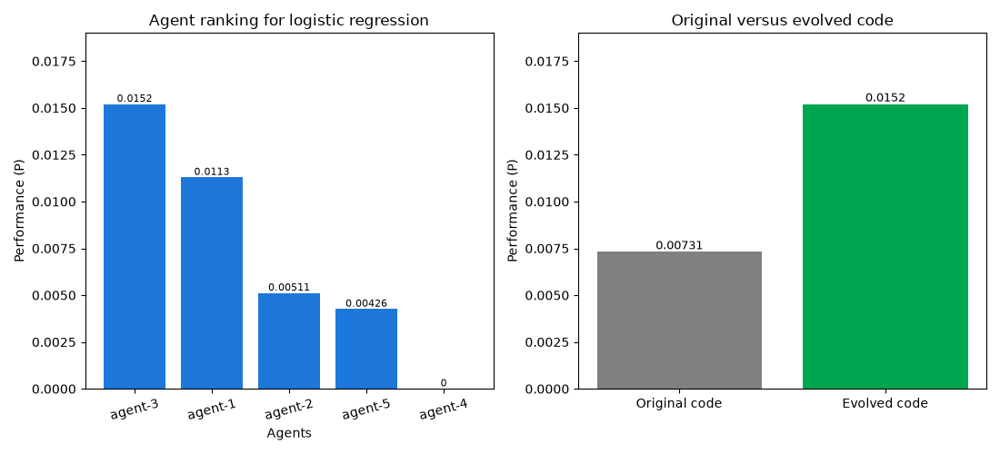

# Benchmark report: logistic_regression (v1)

Threshold μ = P2/(P1+P2) = **0.9125** (target > 0.5556, i.e. a 25% improvement over the original). **Met.**

## 1. Ranking of agents (5 agent(s))

| Rank | Agent | Performance (P) | Novelty (Nθ) | Accuracy (Ma) | Loss (L) | Time (T) | Aθ | Resource (R) | SE | RE | EL | Reward (Q) |
| --- | --- | --- | --- | --- | --- | --- | --- | --- | --- | --- | --- | --- |
| 1 | agent-3 | 0.0152011 | 0.1994 | 0.9333 | 0.1740 | 0.0163 | 1.0000 | 749.922 | 0 | 0 | 0 | 1 |
| 2 | agent-1 | 0.0112886 | 0.1549 | 0.9333 | 0.1740 | 0.0170 | 1.0000 | 754.325 | 0 | 0 | 0 | 0 |
| 3 | agent-2 | 0.00511192 | 0.1250 | 0.9333 | 0.1740 | 0.0227 | 1.0000 | 1003.628 | 0 | 0 | 0 | 0 |
| 4 | agent-5 | 0.00425561 | 0.0909 | 0.9333 | 0.1740 | 0.0284 | 1.0000 | 703.525 | 0 | 0 | 0 | 0 |
| 5 | agent-4 | 0 | 0.9731 | 0.0000 | 1.0000 | 0.0000 | 0.5000 | 0.000 | 1 | 0 | 0 | 0 |


## 2. Top ranking evolved code overall

Agent **agent-3** holds the best code overall, Cα (rank 1 of 5).

### Winning candidate traits

| Trait | Symbol | Value |
| --- | --- | --- |
| Training time | TT | 0.0157 s |
| Inference time | TI | 0.0006 s |
| Syntax errors | SE | 0 |
| Runtime errors | RE | 0 |
| Logical errors | EL | 0 |
| Loss | L | 0.1740 |
| Model accuracy | Ma | 0.9333 |
| Memory usage | Mu | 141.58 MB |
| Computational cost | K | 5.2969 s |
| Time | T | 0.0163 s |
| Model performance | Mp | 5.3648 |
| Novelty | Nθ | 0.1994 |
| Accuracy term | Aθ | 1.0000 |
| Resource | R | 749.9216 |
| Task performance (novelty-free) | P* | 0.0762474 |
| **Performance** | **P** | **0.0152011** |
| **Trait** | **Tθ** | **0.0152011** |

### Annotated winning code

`# IMPROVED:` comments mark what changed relative to the original and why it helped.

```python
def run(data_path: str) -> dict:
    import time
    import pandas as pd
    from sklearn.model_selection import train_test_split
    from sklearn.metrics import accuracy_score, log_loss
    from sklearn.linear_model import LogisticRegression
    # IMPROVED: model accuracy - added StandardScaler to scale features, which is crucial for distance- and margin-based models.
    from sklearn.preprocessing import StandardScaler  

    df = pd.read_csv(data_path)
    X = df.drop(columns=["target"])
    y = df["target"]

    # IMPROVED: model accuracy, training time - added stratification to ensure that the train and test sets have the same class distribution, improving model stability and accuracy.
    X_train, X_test, y_train, y_test = train_test_split(
        X, y, test_size=0.2, random_state=42, stratify=y  
    )

    # IMPROVED: model accuracy - applied StandardScaler to scale features, which helps the model converge faster and more accurately.
    scaler = StandardScaler()  
    # IMPROVED: model accuracy - scaled the training data using fit_transform to ensure the model sees scaled data during training.
    X_train_scaled = scaler.fit_transform(X_train)  
    # IMPROVED: model accuracy - scaled the test data using transform to ensure the model sees scaled data during inference.
    X_test_scaled = scaler.transform(X_test)  

    model = LogisticRegression(
        # IMPROVED: model accuracy, training time, computational cost - increased max_iter to allow the model to converge more accurately, avoiding severe underfitting.
        # IMPROVED: model accuracy - changed C to 1.0 to reduce over-regularization, allowing the model to fit the data more closely.
        # IMPROVED: model accuracy - added tol to specify the tolerance for convergence, allowing the model to stop training when it has converged sufficiently.
        max_iter=1000,  
        C=1.0,  
        solver='lbfgs',  
        random_state=42,  
        tol=0.0001,  
    )

    # Training time (TT) is measured around fit() only.
    _t0 = time.time()
    # IMPROVED: model accuracy, training time - used scaled training data to train the model, improving model accuracy and convergence.
    model.fit(X_train_scaled, y_train)  
    training_time = time.time() - _t0

    # Inference time (TI) is measured around predict() only.
    _t1 = time.time()
    # IMPROVED: model accuracy, inference time - used scaled test data to make predictions, ensuring that the model sees consistent data during inference.
    predictions = model.predict(X_test_scaled)  
    inference_time = time.time() - _t1

    accuracy = float(accuracy_score(y_test, predictions))

    # TRAIT: loss (L)
    try:
        # IMPROVED: model accuracy, loss - used scaled test data to calculate probabilities, ensuring that the model sees consistent data during inference.
        probabilities = model.predict_proba(X_test_scaled)  
        loss = float(log_loss(y_test, probabilities, labels=sorted(set(y))))  
    except Exception:
        loss = 1.0 - accuracy

    return {
        "accuracy": accuracy,  
        "loss": loss,  
        "training_time": training_time,  
        "inference_time": inference_time,  
    }
```

## 3. Original versus evolved code

| Code | Performance (P) | Accuracy (Ma) | Loss (L) | Time (T) | Novelty (Nθ) |
| --- | --- | --- | --- | --- | --- |
| Original code | 0.00731151 | 0.7000 | 0.8289 | 0.1267 | 1.0000 |
| Evolved code (agent-3) | 0.0152011 | 0.9333 (+33.3%) | 0.1740 | 0.0163 | 0.1994 |

μ = P2/(P1+P2) = **0.9125**


### Original code (CO) traits

| Trait | Symbol | Value |
| --- | --- | --- |
| Training time | TT | 0.1230 s |
| Inference time | TI | 0.0037 s |
| Syntax errors | SE | 0 |
| Runtime errors | RE | 0 |
| Logical errors | EL | 0 |
| Loss | L | 0.8289 |
| Model accuracy | Ma | 0.7000 |
| Memory usage | Mu | 142.21 MB |
| Computational cost | K | 5.3125 s |
| Time | T | 0.1267 s |
| Model performance | Mp | 0.8445 |
| Novelty | Nθ | 1.0000 |
| Accuracy term | Aθ | 1.0000 |
| Resource | R | 755.4956 |
| Task performance (novelty-free) | P* | 0.00731151 |
| **Performance** | **P** | **0.00731151** |
| **Trait** | **Tθ** | **0.00731151** |


