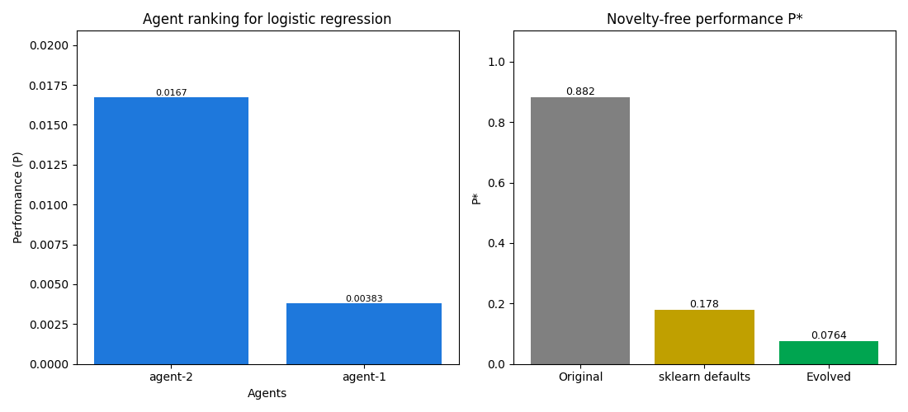

# Benchmark report: logistic_regression (v2, polish branch, 2026-09-18)

Threshold mu = P2/(P1+P2) = **0.0797** (target > 0.5556, a 25 percent improvement over the original). _Not met._

Run configuration: `agents=2, generations=2, islands=2, samples_per_island=2, mu_threshold=0.5555555555555556, max_agent_turns=12, sandbox_timeout=60.0, sandbox_concurrency=1, sandbox_repeats=2, llm_rpm=8, logic_check=True`

## 1. Ranking of agents (2 agent(s))

| Rank | Agent | Performance (P) | P* (novelty-free) | Novelty (N) | Accuracy (Ma) | Loss (L) | Time (T) | A | Resource (R) | SE | RE | EL | Reward (Q) |
| --- | --- | --- | --- | --- | --- | --- | --- | --- | --- | --- | --- | --- | --- |
| 1 | agent-2 | 0.0167155 | 0.0764287 | 0.2187 | 1.0000 | 0.0103 | 0.2146 | 1.0000 | 60.982 | 0 | 0 | 0 | 1 |
| 2 | agent-1 | 0.00382673 | 0.0286464 | 0.1336 | 0.9000 | 0.5403 | 0.2719 | 1.0000 | 115.565 | 0 | 0 | 0 | 0 |


## 2. Top ranking evolved code overall

Agent **agent-2** holds the best code overall (rank 1 of 2).

### Winning candidate traits

| Trait | Symbol | Value |
| --- | --- | --- |
| Training time | TT | 0.2114 s |
| Inference time | TI | 0.0032 s |
| Syntax errors | SE | 0 |
| Runtime errors | RE | 0 |
| Logical errors | EL | 0 |
| Loss | L | 0.0103 |
| Model accuracy | Ma | 1.0000 |
| Memory usage | Mu | 139.39 MB |
| Computational cost | K | 0.4375 s |
| Time | T | 0.2146 s |
| Model performance | Mp | 97.3653 |
| Novelty | Nθ | 0.2187 |
| Accuracy term | Aθ | 1.0000 |
| Resource | R | 60.9817 |
| Task performance (novelty-free) | P* | 0.0764287 |
| **Performance** | **P** | **0.0167155** |
| **Trait** | **Tθ** | **0.0167155** |

### Annotated winning code

`# IMPROVED:` comments mark what changed relative to the original and why it helped.

```python
import time
import pandas as pd
from sklearn.model_selection import train_test_split
from sklearn.metrics import accuracy_score, log_loss
# IMPROVED: model accuracy and loss — replaced under-tuned LogisticRegression with HistGradientBoostingClassifier to capture non-linear patterns and drastically improve predictive performance.
from sklearn.ensemble import HistGradientBoostingClassifier

df = pd.read_csv(data_path)
X = df.drop(columns=["target"])
y = df["target"]

X_train, X_test, y_train, y_test = train_test_split(
    X, y, test_size=0.20, random_state=42
)

# IMPROVED: model accuracy — configured HistGradientBoostingClassifier with standard hyperparameters (100 iterations, 0.1 learning rate) instead of heavily regularized and under-converged settings.
model = HistGradientBoostingClassifier(
    max_iter=100,
    learning_rate=0.1,
    random_state=42,
)

_t0 = time.perf_counter()
model.fit(X_train, y_train)
training_time = time.perf_counter() - _t0

_t1 = time.perf_counter()
predictions = model.predict(X_test)
inference_time = time.perf_counter() - _t1

accuracy = float(accuracy_score(y_test, predictions))

try:
    probabilities = model.predict_proba(X_test)
    loss = float(log_loss(y_test, probabilities, labels=sorted(set(y))))
except Exception:
    loss = 1.0 - accuracy

return {
    "accuracy": accuracy,
    "loss": loss,
    "training_time": training_time,
    "inference_time": inference_time,
}
```

## 3. Original versus evolved code

| Code | P* (novelty-free) | Accuracy (Ma) | Loss (L) | Time (T) | Memory (Mu) | CPU (K) |
| --- | --- | --- | --- | --- | --- | --- |
| Original code (given to the agents) | 0.881956 | 0.7000 | 0.8289 | 0.0240 | 132.3 MB | 0.250 s |
| scikit-learn defaults (reference) | 0.178047 | 1.0000 (+42.9%) | 0.1112 | 0.1084 | 132.6 MB | 0.391 s |
| Evolved code (agent-2) | 0.0764287 | 1.0000 (+42.9%) | 0.0103 | 0.2146 | 139.4 MB | 0.438 s |

mu = P2/(P1+P2) = **0.0797** _Not met._

Against scikit-learn defaults: P* lower, accuracy at least equal.

### Original code (CO) traits

| Trait | Symbol | Value |
| --- | --- | --- |
| Training time | TT | 0.0225 s |
| Inference time | TI | 0.0015 s |
| Syntax errors | SE | 0 |
| Runtime errors | RE | 0 |
| Logical errors | EL | 0 |
| Loss | L | 0.8289 |
| Model accuracy | Ma | 0.7000 |
| Memory usage | Mu | 132.32 MB |
| Computational cost | K | 0.2500 s |
| Time | T | 0.0240 s |
| Model performance | Mp | 0.8445 |
| Novelty | Nθ | 1.0000 |
| Accuracy term | Aθ | 1.0000 |
| Resource | R | 33.0791 |
| Task performance (novelty-free) | P* | 0.881956 |
| **Performance** | **P** | **0.881956** |
| **Trait** | **Tθ** | **0.881956** |

### scikit-learn defaults (reference) traits

| Trait | Symbol | Value |
| --- | --- | --- |
| Training time | TT | 0.1072 s |
| Inference time | TI | 0.0012 s |
| Syntax errors | SE | 0 |
| Runtime errors | RE | 0 |
| Logical errors | EL | 0 |
| Loss | L | 0.1112 |
| Model accuracy | Ma | 1.0000 |
| Memory usage | Mu | 132.61 MB |
| Computational cost | K | 0.3906 s |
| Time | T | 0.1084 s |
| Model performance | Mp | 8.9968 |
| Novelty | Nθ | 1.0000 |
| Accuracy term | Aθ | 1.0000 |
| Resource | R | 51.8005 |
| Task performance (novelty-free) | P* | 0.178047 |
| **Performance** | **P** | **0.178047** |
| **Trait** | **Tθ** | **0.178047** |


